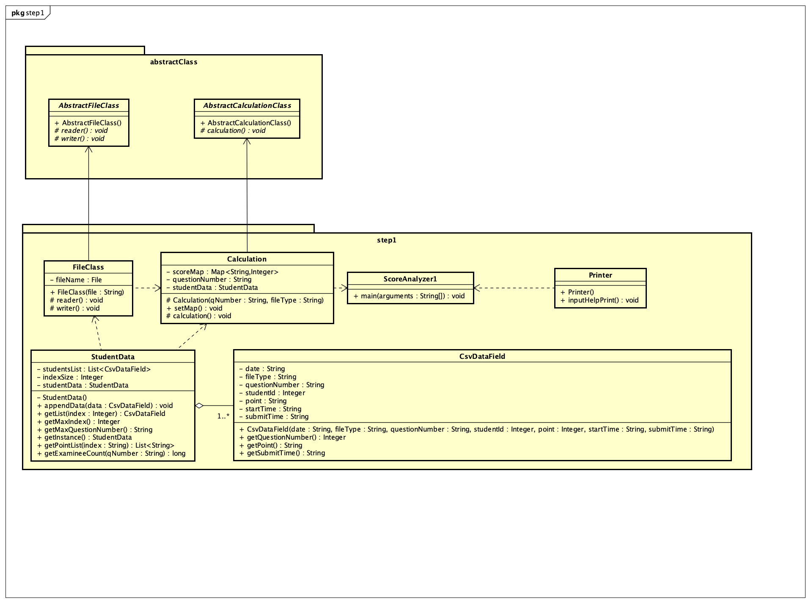
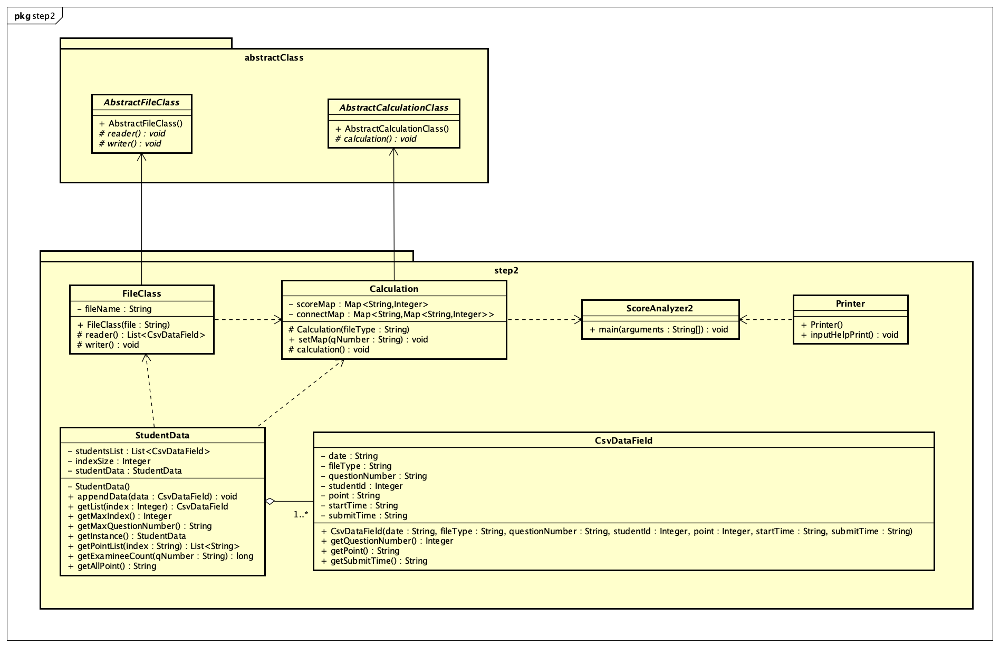

# oop-java
Javaのオブジェクト指向設計練習  
関数型インタフェースも駆使してできるだけ冗長なif, while, for文を使用しないでかく。

[課題のページ](https://ksuap.github.io/2020spring/lesson14/assignments/)  

現在step2までしかやっていない。  

- step1のクラス図  
  

- step2のクラス図  

